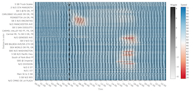
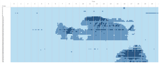
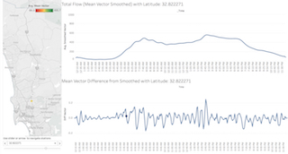
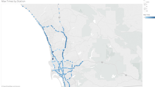
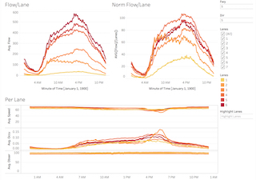

Interactive Visualizations
====
[Introduction](../../) | [Data](Data.md) | [Exploratory Analysis](../../exploration/) | Interactive Visualizations

### Oscillation Propagation

[_Oscillation Propagation Visualization_](https://mas-dse-c6sander.github.io/DSE_Cohort2_Traffic_Capstone/cohort2/vis/WiggleVis/index.html#map_settings)

This visualization is the primary focus of our efforts.  It provides an interactive visual representation of the traffic flow oscillations in three facets.  The top facet is a heatmap that the displays the flow oscillations overlaid with the mean speed on the axes of time and location.  Another facet gives a geographic overview of sensor stations and the oscillation magnitude (color channel) at a single time point.  Using the animation controls, it is possible to view the wave of oscillation magnitudes move across the stations.  The final facet displays the mean oscillations and mean flow for a single station.

### Traffic Classification Heatmap

[_Traffic Classification Heatmap_](https://public.tableau.com/profile/josh.duclos#!/vizhome/HeuristicClusterHeatmap/TimeScrub)

This visualization provides a heatmap representing a heuristic classification of sensor data (limited to I-5 South for all of 2015) on the axes of time and location.  The visualization allows exploration via the mean over a range of dates, mean of a single date, or the mean over a range of dates for a particular day of the week.

### Oscillations By Station

[_Station Oscillation Visualizaiton_](https://public.tableau.com/profile/miki.hardisty#!/vizhome/Wiggles_AllStations_Weekdays/Dashboard1)

This visualization presents a multi-faceted way to explore the oscillations of a set of sensor stations (limited to I-15 South).  The first facet gives a geographical representation of the sensor station location and its mean flow.  The next facet displays the smoothed mean flow of the selected station over the course of an average day.  The last facet displays the oscillations extracted from the mean flow.

### Oscillations Maxima

[_Oscillation Maxima Visualization_](https://public.tableau.com/profile/cj6271#!/vizhome/wiggles_by_min/Dashboard1)

This visualization was created to explore the propagation of the peak oscillation magnitudes for a series of stations (limited to the San Diego area in 2015).  Each station is shaded based on the time when the highest magnitude oscillation occurred.  The results of this visualization prompted the development of the [Oscillation Propagation Visualization](https://mas-dse-c6sander.github.io/DSE_Cohort2_Traffic_Capstone/cohort2/vis/WiggleVis/index.html#map_settings) described above.

### Sensor Health

[_Sensor Health Visualization_](https://public.tableau.com/profile/chris.sanders#!/vizhome/Station_day_analysis/Story1)

The sensor health visualization below provides an interactive exploratory approach for analyzing missing, outlier, and imputed data within the data set.  This is accomplished via a set of multi-faceted dashboards, each focusing on a different aspect of the sensor data.

The "Raw" dashboard provides an interactive display of the raw data (flow, occupancy, and speed) including many options for data selection and filtering.  As the "Per Lane Analysis" dashboard suggests, it provides a series of facets for exploring the relationships of speed, flow, and occupancy across individual lanes.  The "Obser Health Per Partition" gives a quick overview of the average health of all stations as a function of time.  The final dashboard, "Health", provides the ability to visualize the health of stations individually or all stations in a single freeway direction.  

## Visualization List

| Link    | Description |
|---------|-------------|
| [WiggleVis](https://mas-dse-c6sander.github.io/DSE_Cohort2_Traffic_Capstone/cohort2/vis/WiggleVis/index.html#map_settings) | Visualization of Wiggle and Speed |
| [HeuristicClusterHeatmap](https://public.tableau.com/profile/josh.duclos#!/vizhome/HeuristicClusterHeatmap/TimeScrub) | Heatmaps to exploration classification of traffic in Tableau |
| [Wiggles_AllStations_Weekdays](https://public.tableau.com/profile/miki.hardisty#!/vizhome/Wiggles_AllStations_Weekdays/Dashboard1) | Tableau Dashboard to visualize difference in wiggle flow and mean wiggle |
| [Traffic_Wiggles](https://public.tableau.com/profile/miki.hardisty#!/vizhome/traffic_wiggles/Dashboard1) | Tableau Dashboard to visualize the average smoothed vector over a freeway |
| [Wiggles_by_min](https://public.tableau.com/profile/cj6271#!/vizhome/wiggles_by_min/Dashboard1) | Tableau sensor station max oscillation map |
| [SensorHealth](https://public.tableau.com/profile/chris.sanders#!/vizhome/Station_day_analysis/Story1) | Tableau Dashboard of sensor health |
