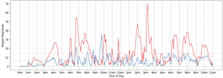
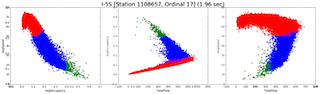
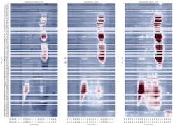

Exploration
====
[Introduction](../) | [Data](../documents/report/Data.md) | Exploratory Analysis | [Interactive Visualizations](../documents/report/Visualizations.md)

## Flow Oscillation ("Wiggles")

### Wavelet Application to Flow

Fourier transform analysis of the mean flow waveform indicates there are several strong cyclical components. Analysis of specific frequencies within the wiggle waveforms themselves may provide useful data for visualizing wiggle propagation in both time and space.  Using wavelets, we attempt to isolate the wiggles from the overall mean flow and plot them in time/space to identify propagation.

| Related Links |
| ----- |
| [wiggles_wavelets_exploration2.ipynb](https://github.com/mas-dse-c6sander/DSE_Cohort2_Traffic_Capstone/blob/master/cohort2/exploration/wiggles_wavelets_exploration2.ipynb) |
| [Wiggle/Wavelet Visualization](https://mas-dse-c6sander.github.io/DSE_Cohort2_Traffic_Capstone/cohort2/vis/WiggleVis/index.html#map_settings) |

### On-Ramp/Off-Ramp Oscillations

As we have discovered with previous analysis, a set of oscillations in traffic flow (wiggles) appears within the mean flow of the main-line highway sensors (ie. main lanes of travel). These fluctuations exhibit a period of approximately 1/2 hour.

We have hypothesized these wiggles are an artifact of the natural rhythm of travelers attempting to arrive at their destination or leaving from their start point on the hour or half-hour. However, it is also possible that these fluctuations are due to the method by which the data is collected and processed. The following analysis attempts to discover evidence that the oscillations are not an artifact of data collection.

| Related Links |
| ----- |
| [wiggle_ramp_relationships2.ipynb](https://github.com/mas-dse-c6sander/DSE_Cohort2_Traffic_Capstone/blob/master/cohort2/exploration/wiggle_ramp_relationships2.ipynb) |

### Weekend vs. Weekday Oscillations

The traffic flow oscillations (wiggles) appear to occur in a pattern that suggests they are not random but are instead a reflection of driver behavior. To further validate the hypothesized wiggle cause, we need to explore and test additional related hypotheses.

If the flow oscillations are due mostly to drivers attempting to arrive at their destinations (eg. work) on or near the hour (or half-hour), the magnitude of the weekday oscillations should be larger than the magnitude of weekend wiggles.

| Related Links |
| ----- |
| [wiggles_magnitude_weekend_weekday.ipynb](https://github.com/mas-dse-c6sander/DSE_Cohort2_Traffic_Capstone/blob/master/cohort2/exploration/wiggles_magnitude_weekend_weekday.ipynb) |

## Traffic Modeling

### Traffic Speed/Flow/Occupancy Relationships

Given the set of attributes in the traffic data, we conduct exploratory analysis on Flow, Speed, and Occupancy and generate plots that show the interaction between the two.  In doing so, we attempt to identify relationships between the attributes and potentially identify patterns within the data to use for further analysis.

| Related Links |
| ----- |
| [traffic_flow_speed_occupancy_relationship.ipynb](https://github.com/mas-dse-c6sander/DSE_Cohort2_Traffic_Capstone/blob/master/cohort2/exploration/traffic_flow_speed_occupancy_relationship.ipynb) |

### Traffic State Clustering

The traffic data provides three distinct dimensions: flow, occupancy, and speed. Using these three features, it may be possible to classify traffic into three distinct states: normal flow, degraded flow, and traffic jam.  In this exploration, we attempt to classify the traffic data (flow, occupancy, and speed) using several clustering algorithms.  Having identified BIRCH as a good candidate, we further analyze the effectiveness of clustering.

| Related Links |
| ----- |
| [traffic_flow_speed_occupancy_clustering.ipynb](https://github.com/mas-dse-c6sander/DSE_Cohort2_Traffic_Capstone/blob/master/cohort2/exploration/traffic_flow_speed_occupancy_clustering.ipynb) |
| [traffic_clustering_i5s.ipynb](https://github.com/mas-dse-c6sander/DSE_Cohort2_Traffic_Capstone/blob/master/cohort2/exploration/traffic_clustering_i5s.ipynb) |
| [Heuristic Cluster Heatmap Visualization](https://public.tableau.com/profile/josh.duclos#!/vizhome/HeuristicClusterHeatmap/TimeScrub) |

### Fundamental Diagram of Traffic

As with any academic exercise, it is often helpful to review the research done by others in the topic. In particular, we are interested in research related to models describing traffic that could potentially be used for prediction.  In this particular exploration, we review the three-phase traffic theory and the related fundamental diagram of traffic.

Three-phase traffic theory describes three phases of traffic (free-flow, synchronized flow, and wide-moving jam), which can be captured using velocity, flow, and density of vehicles.

The fundamental diagram of traffic captures the characteristic elements of traffic necessary to identify traffic phases.

| Related Links |
| ----- |
| [traffic_fundamental_diagram.ipynb](https://github.com/mas-dse-c6sander/DSE_Cohort2_Traffic_Capstone/blob/master/cohort2/exploration/traffic_fundamental_diagram.ipynb) |

### Sensor Health

The data set as retrieved from PeMS contains data from a number of failed or failing sensor systems.  Missing date is imputed by the PeMS system and stations that are in the process of failing can provide inconsistent results.  In this exploration, we attempt to evaluate the health of the station data and its effect on the resulting data set.

| Related Links |
| ----- |
| [data_exploration_with_sensor_health.ipynb](https://github.com/mas-dse-c6sander/DSE_Cohort2_Traffic_Capstone/blob/master/cohort2/exploration/data_exploration_with_sensor_health.ipynb) |
| [Sensor Health Visualization](https://public.tableau.com/profile/chris.sanders#!/vizhome/Station_day_analysis/Story1) |

### Computer Vision Jam Identification

Traffic flow, when visualized in a heatmap by time and location, provides an intuitive representation of positional and temporal changes (in this instance, traffic jams).  Using computer vision techniques, we explore the possibility of identifying the boundaries (both in time and space) of these jams in an automated manner.

| Related Links |
| ----- |
| [traffic_jam_exploration.ipynb](https://github.com/mas-dse-c6sander/DSE_Cohort2_Traffic_Capstone/blob/master/cohort2/exploration/traffic_jam_exploration.ipynb) |

### Traffic Flow Prediction

In this exploration, we introduce an ensemble model for traffic flow prediction.  This model consists of two sub-models. The first model predicts traffic patterns for an individual station based on the preceding station's flow, occupancy, and intermediate on ramp and off ramp flows using linear regression. The second model predicts traffic patterns for a freeway from the stations, and previous station state.

| Related Links |
| ----- |
| [traffic_prediction_model.ipynb](https://github.com/mas-dse-c6sander/DSE_Cohort2_Traffic_Capstone/blob/master/cohort2/exploration/traffic_prediction_model.ipynb) |

### Traffic Statistics

In reviewing the heatmap for speed, it was observed that parts of the patterns are consistent. To take the analysis a step further, the task in this notebook is to obtain characteristic statistics (mean and standard deviation) for each of the metrics - Speed, Flow and Occupancy. Because there may be variability with the day of the week, each day of the week is heat-mapped.

| Related Links |
| ----- |
| [traffic_statistics.ipynb](https://github.com/mas-dse-c6sander/DSE_Cohort2_Traffic_Capstone/blob/master/cohort2/exploration/traffic_statistics.ipynb) |

## Jupyter Notebook List

| File    | Description |
|---------|-------------|
| [learning_fft.ipynb](https://github.com/mas-dse-c6sander/DSE_Cohort2_Traffic_Capstone/blob/master/cohort2/exploration/learning_fft.ipynb) | Discussion of Fourier transforms and application to traffic data. |
| [learning_fft_wavelets.ipynb](https://github.com/mas-dse-c6sander/DSE_Cohort2_Traffic_Capstone/blob/master/cohort2/exploration/learning_fft_wavelets.ipynb) | Initial exploration of Fourier transforms as applied to traffic flow. Brief look at wavelets (continued in the notebook below). |
| [learning_wavelet.ipynb](https://github.com/mas-dse-c6sander/DSE_Cohort2_Traffic_Capstone/blob/master/cohort2/exploration/learning_wavelet.ipynb) | Initial exploration into wavelets, wavelet transformation, and wavelet scale/shift. |
| [wiggles_wavelets_exploration2.ipynb](https://github.com/mas-dse-c6sander/DSE_Cohort2_Traffic_Capstone/blob/master/cohort2/exploration/wiggles_wavelets_exploration2.ipynb) | Exploration of wavelet forms and wavelet tuning as applied to the mean flow. Wavelet transform is then used to extract mean flow wiggles and visualize as wave propagation in time/space. |
| [wiggles_analyze_example.ipynb](https://github.com/mas-dse-c6sander/DSE_Cohort2_Traffic_Capstone/blob/master/cohort2/exploration/wiggles_analyze_example.ipynb) | Initial exploration of "wiggles" (oscillations in the mean flow).  Uses smoothed mean flow to extract the wiggle waveform. |
| [wiggles_speed_flow_occupancy.ipynb](https://github.com/mas-dse-c6sander/DSE_Cohort2_Traffic_Capstone/blob/master/cohort2/exploration/wiggles_speed_flow_occupancy.ipynb) | Analysis of wiggles for flow, speed, and occupancy. |
| [wiggle_ramp_relationships2.ipynb](https://github.com/mas-dse-c6sander/DSE_Cohort2_Traffic_Capstone/blob/master/cohort2/exploration/wiggle_ramp_relationships2.ipynb) | Exploration and analysis of on-ramp/off-ramp wiggles (mean flow) in relation to main-line wiggles. |
| [wiggles_across_multiple_years.ipynb](https://github.com/mas-dse-c6sander/DSE_Cohort2_Traffic_Capstone/blob/master/cohort2/exploration/wiggles_across_multiple_years.ipynb) | Exploration and visualization of wiggles and mean flow across multiple years. |
| [wiggles_magnitude_weekend_weekday.ipynb](https://github.com/mas-dse-c6sander/DSE_Cohort2_Traffic_Capstone/blob/master/cohort2/exploration/wiggles_magnitude_weekend_weekday.ipynb) | Analysis of weekend vs. weekday wiggle magnitudes. |
| [data_exploration_with_sensor_health.ipynb](https://github.com/mas-dse-c6sander/DSE_Cohort2_Traffic_Capstone/blob/master/cohort2/exploration/data_exploration_with_sensor_health.ipynb) | Exploratory analysis of traffic meta data, specifically sensor health, measurement accuracy, and the implications of data imputation. |
| [traffic_flow_speed_occupancy_relationship.ipynb](https://github.com/mas-dse-c6sander/DSE_Cohort2_Traffic_Capstone/blob/master/cohort2/exploration/traffic_flow_speed_occupancy_relationship.ipynb) | Exploratory analysis of flow, speed, and occupancy relationships. |
| [traffic_flow_speed_occupancy_clustering.ipynb](https://github.com/mas-dse-c6sander/DSE_Cohort2_Traffic_Capstone/blob/master/cohort2/exploration/traffic_flow_speed_occupancy_clustering.ipynb) | Survey of clustering algorithms as applied to traffic data. |
| [traffic_clustering_i5s.ipynb](https://github.com/mas-dse-c6sander/DSE_Cohort2_Traffic_Capstone/blob/master/cohort2/exploration/traffic_clustering_i5s.ipynb) | Exploration of speed/occupancy/flow classification and clustering for I-5 south.  Includes Birch clustering and heuristic classification. |
| [traffic_fundamental_diagram.ipynb](https://github.com/mas-dse-c6sander/DSE_Cohort2_Traffic_Capstone/blob/master/cohort2/exploration/traffic_fundamental_diagram.ipynb) | Discussion of three-phase traffic theory and the fundamental diagram of traffic (including application to CalTrans traffic data).  |
| [traffic_jam_exploration.ipynb](https://github.com/mas-dse-c6sander/DSE_Cohort2_Traffic_Capstone/blob/master/cohort2/exploration/traffic_jam_exploration.ipynb) | Computer vision approach to traffic jam identification/classification using speed heatmap. |
| [traffic_prediction_model.ipynb](https://github.com/mas-dse-c6sander/DSE_Cohort2_Traffic_Capstone/blob/master/cohort2/exploration/traffic_prediction_model.ipynb) | Traffic flow prediction model (sources and sinks) exploration and analysis. |
| [traffic_statistics.ipynb](https://github.com/mas-dse-c6sander/DSE_Cohort2_Traffic_Capstone/blob/master/cohort2/exploration/traffic_statistics.ipynb) | Statistical analysis of flow, occupancy, and speed including heatmap visualizations. |
